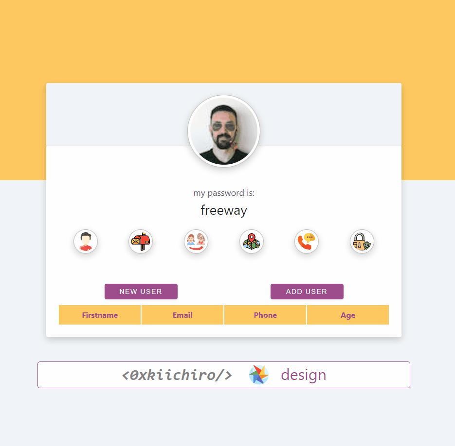

# Random User Generator V2

Made a project that use an open source REST API to fetch a random persons data and render on page on click to different buttons.

User can use the add user button to add current user values to an array. We map this array to render table row elements with the data.

# Technologies used

HTML, CSS, JS, React.js, Axios

Axios Link: https://axios-http.com/docs/intro

## Check the full-functioning site at: https://0xkiichiro.github.io/react-random-user-generator

## Comments

All comments appreaciated. You can contact me:

email: 0xkiichiro@proton.me
twitter: @0xkiichiro

## License

[MIT](https://choosealicense.com/licenses/mit/)
